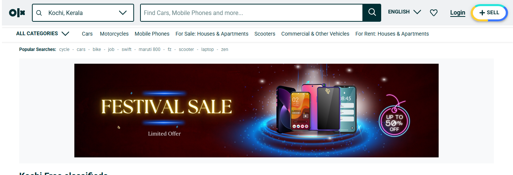

# OLX Clone - Node.js & React.js

This is an **OLX Clone** application built using **Node.js** (backend) and **React.js** (frontend). The application allows users to register, log in, and post ads with image uploads. The ads can be viewed by other users, making it a platform for buying and selling items.

## Features
- **User Authentication**: Users can register, log in, and manage their accounts.
- **Post Ads**: Users can create posts with title, description, and images.
- **Image Upload**: Ads can have images uploaded, which are stored on the server or a cloud service (e.g., AWS S3).
- **View Ads**: Users can browse all posted ads in a listing format.

## Tech Stack
- **Frontend**: React.js
- **Backend**: Node.js, Express.js
- **Database**: MongoDB (with Mongoose)
- **Image Upload**: Cloudinary or local file storage (depending on implementation)

## Folder Structure

The folder structure of the project is organized into two main parts: the **frontend** (React.js) and the **backend** (Node.js). Below is an image of the folder structure.

Here is the general structure:

